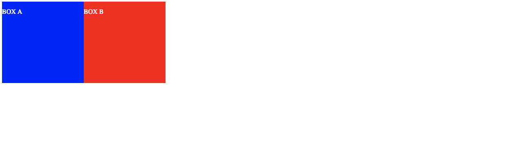

# HTML&CSSとWebデザインが 1冊できちんと身につく本

# Chapter3 知っておきたいHTMLのきほんと書き方

# 3.1 HTMLのきほんの知識

# 1.タグのきほん的な付け方

次のようにタグを付けます。
接頭のタグを開始タグ、接尾のタグを終了タグと呼びます。
```html
<p>テキスト</p>
```

タグの中には終了タグを省略できるタグもあります。

```html
<li>, <dt>, <dd>, <tr>, <th>, <td> etc...
```

また単独で記述するタグもあります。

```html
, <br>, <hr>, <meta> etc..
```

タグの属性を書き換えることで要素の設定を変更します。
次の例だとsrcが属性名、"images/log.png"が属性値となります。
この形式で属性を記述するのがルールみたいです。

```html

```

# 2.HTMLの構造は2つの大きな箱に分かれている

HTMLは次のような構造になっている

```
HTML − head
     └ body
```

HTMLはhead要素とbody要素に分かれています。
各要素の役割を次に記載します。

| 要素 | 説明 |
| --- | --- |
| head | 主にコンピュータが参照する情報を記載する |
| body | Webブラウザに表示される内容を記載する |

# 3. ページの基本情報をあらわすおもなタグ

headにはどのような言語、何という名前で、どのファイルとリンクしているかなど記述する。
そのためheadはブラウザや検索エンジンにとっては非常に重要な情報です。
headに記載できる要素として次のようなものがあります。


| 要素 | 説明 |
| --- | --- |
| meta | 文書に関するメタ−データを指定する。<br> 属性によって様々な役割をもたせることができる。|
| title | 文書のタイトルを表す。ブラウザのタイトルバーに表示される。 |
| link | 文書を別の文書関連付ける。 |
| style |文書のスタイル情報を記載する記述方法は、<br>開始タグと終了タグのあいだに通常どおりのCSSの文法で記述する。|

# 4. ページの内容をあらわすおもなタグ

bodyに記載できる要素は非常に多くのものがあります。
ここでは代表的なもののみ抜粋し次に記載します。

## p

文章の段落を表す。

```html
<p>paragraph1</p>
<p>paragraph2</p>
<p>paragraph3</p>
<p>paragraph4</p>
<p>paragraph5</p>
```


## h1〜h6

hはheaddingの略で、文章内の見出しを指定する際に利用する。
文章の階層構造を意識し単純に大きい文字を使いたいからh1を使うというような、
レイアウト的な視点の使い方はしないようにしましょう。


```html
<h1>見出し１</h1>
<h2>見出し２</h2>
<h3>見出し３</h3>
<h4>見出し４</h4>
<h5>見出し５</h5>
<h6>見出し６</h6>
```


## section

見出しを伴う、意味的に関係のあるまとまりを表す。
必ず見出しを入れることが推奨されている。

```html
<section>
    <h1>Paragraph</h1>
    <p>AAAAAAAAAAAAAAAAAAA</p>
    <p>BBBBBBBBBBBBBBBBBBB</p>
    <p>CCCCCCCCCCCCCCCCCCC</p>
    <p>DDDDDDDDDDDDDDDDDDD</p>
    <p>EEEEEEEEEEEEEEEEEEE</p>
    <p>FFFFFFFFFFFFFFFFFFF</p>
</section>
```


## article

その内容だけを取り出したときに独立したコンテンツとして成り立つ場合に使用します。

```html
<body>
    <article>
        <h1>見出し1</h1>
        <section>
            <h2>見出し2</h2>
            <p>AAAAAAAAAAAAAAAAAAA</p>
            <p>BBBBBBBBBBBBBBBBBBB</p>
            <p>CCCCCCCCCCCCCCCCCCC</p>
        </section>
        
        <section>
            <h2>見出し2</h2>
            <p>DDDDDDDDDDDDDDDDDDD</p>
            <p>EEEEEEEEEEEEEEEEEEE</p>
            <p>FFFFFFFFFFFFFFFFFFF</p>
        </section>
    </article>
</body>
```


## nav

その内容がページの主要なナビゲーションであることを表すときに使用する。

```html
    <nav>
        <ul>
            <li><a href="/">ROOT</a>
            <li><a href="/one">ONE</a>
            <li><a href="/two">TWO</a>
            <li><a href="/three">THREE</a>
        </ul>
    </nav>
```


## aside

本筋とは関係しているものの、メインコンテンツから切り離すことが可能なセクションを表す。
例えばサイドバーなどによく使われるらしいが、だぶんこのタグを使わないければいけないという制約はないけどモラル的に使ったほうがよいはず。


```html
    <aside>
        <ul>
            <li><a href="/">ROOT</a>
            <li><a href="/one">ONE</a>
            <li><a href="/two">TWO</a>
            <li><a href="/three">THREE</a>
        </ul>
    </aside>
```


## div

div要素そのものには特別な意味はない、
div要素で囲まれた範囲をグループとして扱えるので、
レイアウト目的の箱として使われる。

### 💡 すべてのHTML要素で使用できる属性 ”グローバル属性”

すべての要素で使用できるグローバル属性というものがあります。
グローバル属性で代表的なものがid属性とclass属性です。
これらはCSSでスタイリングするうえで必ずといっていいほど使用します。

次のようにマークアップの際にdiv要素のid属性を決め、
それを目印にしてCSSでスタイリングするのが一般的です。

```html

<!DOCTYPE html>
<html lang="ja">
    <head>
        <meta charset=“UFT-8”>
        <title>Sample</title>
        <style>
            #div1 {
                background: #eeeeff
            }
            #div2 {
                background: #eeffee                
            }
        </style>
    </head>

    <body>
        <div id="div1">
            <p>スタイル1を適応した場合</p>
        </div>
        <div id="div2">
            <p>スタイル2を適応した場合</p>
        </div>
    </body>
</html>
```


### a

a要素はハイパーリンクを指定する要素です。
ちなみにaはanchorの略で、鎖が船を繋ぎ止めることろから来ています。


```html
<body>
  <a href="http://google.co.jp">Google</a>のWebサイトはこちらです。
</body>
```


### img

「image」つまり画像を表示する際に使用します。
次のようにsrc属性で画像ファイルの場所、
alt属性には画像が利用できない環境のために代替テキストを入力します。

```html

```


# 3.2 サンプルサイト共通のHTMLを書いてみよう

# 1. サンプルサイトの共通要素を確認する

* ヘッダー
* コンテンツエリア
* フッダー

# 2. HTML文書の基本構造を記述する


HTML5のDOCTYPE宣言は非常にシンプルです。
次のように記載すればOKです。

```html
<!DOCTYPE html>
```

そしてヘッダとかボディとか書くとこうなります。

```html
<!DOCTYPE html>
<html>
    <head>
        <meta charset="utf-8">
        <title>サンプルページ</title>
    </head>

    <body></body>
</html>

```

# 3. ページの基本構造を記述する

ヘッダーはheaderタグ、フッターはfooterタグ、
コンテンツエリアはdivタグで基本構造を記述します。

```html
<!DOCTYPE html>
<html>
    <head>
        <meta charset="utf-8">
        <title>サンプルページ</title>
    </head>
        
    <body>
        <header></header>
        <div id="wrap">
        
        </div>
        <footer></footer>
    </body>
</html>
```

# 4. header要素内を記述する

headerにログとナビゲーションを追加します。

```html
<!DOCTYPE html>
<html>
    <head>
    <meta charset="utf-8">
    <title>サンプルページ</title>
</head>

<body>
    <header>
        <div class="logo">
            <a href="index.html"></a>
        </div>
        <nav>
            <ul class="global-nav">
                <li><a href="portfolio.html">Portfolio</a></li>
                <li><a href="about.html">About</a></li>
                <li><a href="contact.html">Contact</a></li>
            </ul>
        </nav>
    </header>
    <div id="wrap">

    </div>
    <footer></footer>
</body>
</html>
```

# 5.コンテンツエリアを記述する

共通ファイルの作成なのでとりあえずコンテンツエリアは記述しない。
５章以降に色々記述していきます。

# 6. footer要素内を記述する

smallタグを使ってfooterにコピーライトを記載します。

💡smallタグって?

```
「SMALL」とは、テキストを一回り小さくするためのタグです。
<big>～</big>のタグで囲まれたテキストは1段階大きなサイズで表示され、
<font>の<font size="-1">と同じ意味を持ちます。
免責や警告などの注釈や細目などを表す際に活用されますが、
文字の表示はユーザーのブラウザの設定に左右されるため、
大きさを確定させることはできません。

<small>は非推奨タグではありませんが、
この指定内容はスタイルシートで代替できるので、
できるだけスタイルシートで指定しましょう。
スタイルシートで指定した場合は<span style="font-size: small">～</span>などと記述します。
ちなみに、<small>の中にさらに<small>を入れ子にして入れることができ、
入れ子のタグ内の文字はより小さな文字で表示されます（ブラウザにより制限がある場合があります）。
```

```html
<!DOCTYPE html>
<html>
    <head>
    <meta charset="utf-8">
    <title>サンプルページ</title>
</head>

<body>
    <header>
        <div class="logo">
            <a href="index.html"></a>
        </div>
        <nav>
            <ul class="global-nav">
                <li><a href="portfolio.html">Portfolio</a></li>
                <li><a href="about.html">About</a></li>
                <li><a href="contact.html">Contact</a></li>
            </ul>
        </nav>
    </header>
    <div id="wrap">

    </div>
    <footer>
        <small>(C)2019 Kaledot725.</small>
    </footer>
</body>
</html>
```

# 3.3　見やすいコードとコメントの書き方

インデントをつけようということ!!

# ３章でできたところ

3章でできたところは次のよう感じ！！


# Chaptrer4 CSSのきほんと書き方


# 4.1 CSSのきほん知識

# 1. 見た目をデザインするCSS

* CSSはCcascading Style Sheetsの略です。
* CSSはHTML文書のレイアウトや装飾など見た目を指定するための言語です。

# 2. CSSのきほん的な書き方
次がCSSの基本的な文法です。
```css
セレクタ{プロパティ:値;}
```

文法の通り、次の例だとpがセレクタ、colorがプロパティ、redが値となる。
```css
p{color:red;}
```

ひとつのセレクタには複数のプロパティを記述できる。

```css
p {
  color: red;
  font-weight: bold;
  margin-left: 20px;
}
```

また複数のセレクタに同じスタイル宣言を設定できる。

```css
p,h1 {
  color: red;
  font-weight: bold;
  margin-left: 20px;
}
```

特定の場所にあるセレクタだけに別の指定をしたいがある。
そのときは次のように親要素を記述してあげます。
次の場合だとheader要素の中にあるp要素だけをセレクタにするという意味になる。

```css
header p {
  color: red;
  font-weight: bold;
  margin-left: 20px;
}
```

# 3. テキストを装飾するプロパティ

## font-size 

文字のサイズを指定するプロパティです。
サイズの指定はpx(ピクセル)、％（パーセント）、em(エム)などがある。

| 単位 |説明 |
|----|-----|
| px | モニタの解像度の最小単位を1pxとして指定する |
| %  | 親要素の文字サイズ1文字文を100%として指定する|
| em | 親要素の文字サイズ1文字文を1emとして指定する |


pxで指定すると次のような感じになる

```html
    <div>
        <p style="font-size: 1px">1px</p>
        <p style="font-size: 2px">2px</p>
        <p style="font-size: 3px">3px</p>
        <p style="font-size: 4px">4px</p>
        <p style="font-size: 5px">5px</p>
        <p style="font-size: 6px">6px</p>
        <p style="font-size: 7px">7px</p>
        <p style="font-size: 8px">8px</p>
        <p style="font-size: 9px">9px</p>
        <p style="font-size: 10px">10px</p>
        <p style="font-size: 11px">11px</p>
        <p style="font-size: 12px">12px</p>
        <p style="font-size: 13px">13px</p>
        <p style="font-size: 14px">14px</p>
        <p style="font-size: 15px">15px</p>
        <p style="font-size: 16px">16px</p>
    </div>
```


%で指定すると次のような感じになる

```html
    <div>
        <p style="font-size: 10%">10%</p>
        <p style="font-size: 20%">20%</p>
        <p style="font-size: 30%">30%</p>
        <p style="font-size: 40%">40%</p>
        <p style="font-size: 50%">50%</p>
        <p style="font-size: 60%">60%</p>
        <p style="font-size: 70%">70%</p>
        <p style="font-size: 80%">80%</p>
        <p style="font-size: 90%">90%</p>
        <p style="font-size: 100%">100%</p>
    </div>
```


emで指定すると次のような感じになる

```html
    <div>
        <p style="font-size: 1em">1em</p>
        <p style="font-size: 2em">2em</p>
        <p style="font-size: 3em">3em</p>
    </div>
```


## font-weight

文字の太さを設定するプロパティです。
値は400を基準とします。

```html
    <div>
        <p style="font-weight: : 100">font-weight 100</p>
        <p style="font-weight: 200">font-weight 200</p>
        <p style="font-weight: 300">font-weight 300</p>
        <p style="font-weight: 400">font-weight 400</p>
        <p style="font-weight: 500">font-weight 500</p>
        <p style="font-weight: 600">font-weight 600</p>
        <p style="font-weight: 700">font-weight 700</p>
        <p style="font-weight: 800">font-weight 800</p>
        <p style="font-weight: 900">font-weight 900</p>
    </div>
```


## line-height

行間を設定するプロパティです。
単位をつけずに記述することが一般的ですが、pxなどの単位で指定することができる。

```html
    <div>
        <p style="line-height : 1">line-height 1</p>
        <p style="line-height : 1.5">line-height 1.5</p>
        <p style="line-height : 2">line-height 2</p>
        <p style="line-height : 2.5">line-height 2.5</p>
        <p style="line-height : 3">line-height 3</p>
        <p style="line-height : 3.5">line-height 3.5</p>
        <p style="line-height : 4">line-height 4</p>
        <p style="line-height : 4.5">line-height 4.5</p>
        <p style="line-height : 5">line-height 5</p>
    </div>
```


## text-align

行揃えの一を指定するプロパティです。
leftは左揃え、rightは右揃え、centerは中央、justifyは均等割付です。

```html
  <div>
      <p style="text-align : center">center</p>
      <p style="text-align : right">right</p>
      <p style="text-align : left">left</p>
      <p style="text-align : justify">justify</p>
  </div>
```


## color

文字の色を指定する際に使用するプロパティです。

```html
    <div>
        <p style="color: blue">blue</p>
        <p style="color: #00ff00">green</p>
        <p style="color: rgb(255,0,0)">red</p>
    </div>
```


# 4.レイアウトデザインを設計するプロパティ

## margin

隣り合う要素との距離、つまり外側の余白を指定するプロパティです。

```html
<body style="background: gray;">
    <div style="background: : aquamarine;margin-top: 100px; margin-bottom: 200px; margin-left: 300px; margin-right: 1000px; border-color: pink; border-width: 1px; border-style: solid;">
        <p style="color: black">SAMPLE TEXT</p>
    </div>
</body>
```


## padding

要素の緑から内側の余白を指定するためのものです。

```html
<body style="background: white;">
    <div style="background: aquamarine;padding-top: 100px; padding-bottom: 200px; padding-left: 300px; padding-right: 1000px; border-color: pink; border-width: 1px; border-style: solid;">
        <p style="color: black">SAMPLE TEXT</p>
    </div>
</body>
```


## width・height

widthプロパティは要素の幅、heightプロパティは要素の高さを指定するプロパティです。

```html
<body style="background: white;">
    <div style="background: aquamarine;width: 200px; height: 100px">
        <p style="color: black">SAMPLE TEXT</p>
    </div>
</body>
```


💡 スタイルが継承されるプロパティ
* プロパティの中には親要素から小要素へスタイルが継承されるものがある。
* colorやfontがそのひとつです

# 5. CSSを記述する場所について

タグにstyle属性に直接記述する場合
```html
<p style="color: black">SAMPLE TEXT</p>
```

head-style要素に記述する場合
```html
<head>
    <meta charset="utf-8">
    <title>テスト</title>
    <style>
        p { color: black }
    </style>
</head>

<body>
    <p>SAMPLE TEXT</p>
</body>
```

外部ファイルに記述する場合
* HTMLとCSSを切り分けることでWebブラウザや検索エンジンに効率よく正確な情報を伝えられる
* ひとつのCSS文書を複数のHTMLファイルへリンクさせることができるので効率良くページを修正、管理できる。

```css
p {
    color : black;
}
```

```html
<head>
    <meta charset="utf-8">
    <title>テスト</title>
    <link href="test.css" rel="stylesheet"/>
</head>

<body>
    <p>SAMPLE TEXT</p>
</body>
```

💡スタイル指定が競合した場合の優先順位

| No | ルール | 内容 |
| -- | ----- | --- |
| 1  | 記述場所による優先順位 |　外部ファイルに記述 < style要素内に記述 < タグのstyleに直接記述　|
| 2  | 記述の順番による優先順位 | 優先順位が同じ場合、後から記述したものが優先 |
| 3  | セレクタの種類による優先順位 | どのセレクタを指定するかで優先順位が変わる |

# 4.2 CSSを書いてみよう<ページの基本設定を記述する>

* リセットCSSというものがある、ブラウザごとにデフォルトスタイルが決まっている。
  これを解除するCSSをリセットCSSと呼ばれいらいろな手法が試されている。

* 擬似クラスというものがあり、その要素がどういった状態にあるのか指定するものらしい。
  a要素だとhover,Visitedのようにマスクをホバーしたとき、そのリンクにアクセスしたときのような状態が定義されている。
  
# 4.3 CSSを書いてみよう<レイアウトの詳細を記述する>


* Webサイトのの横幅のサイズは960pxが標準である。
  その根拠としては最も使われているディスプレイが1024px * 768pxであるため
  
* class属性にCSSを設定することで、あのpにはこのスタイル、 
  そのpにはあのスタイルと指定できるようになる。

* floatは要素を右または左に寄せて配置できる

* clearでfloatなどの回り込みを解除できる


## floatの配置パターン

例えば次のようなdivタグが2つある場合、
floatを指定することで配置パターンを変えることができる。

```html
    <div class="box-a">
        <p>BOX A</p>
    </div>
    <div class="box-b">
        <p>BOX B</p>
    </div>
```

### float:leftを指定してbox-bを回り込ませる

```css
.box-a {
    width: 200px;
    height: 200px;
    float: left;
    background: blue;
}

.box-b {
    width: 200px;
    height: 200px;
    float: left;
    background: red;
}
```



### float:leftとfloat:rightを指定して左右に配置

```css
.box-a {
    width: 200px;
    height: 200px;
    float: left;
    background: blue;
}

.box-b {
    width: 200px;
    height: 200px;
    float: right;
    background: red;
}
```


### float:rightを指定して右に寄せて配置

```css
.box-a {
    width: 200px;
    height: 200px;
    float: right;
    background: blue;
}

.box-b {
    width: 200px;
    height: 200px;
    float: right;
    background: red;
}

```


## 4.4 フォントについて知ろう

* フォントが登録されていない場合、代替フォントで表示される
* 特殊なフォントを使いたいときは画像を作成し、img要素で掲載するのが一般的
* Webフォントという仕組みがある、インターネット上にあるフォントデータを参照するという方法です。
  インターネット上にあるフォントをダウンロードする、そして読み込むため動作が遅くなる可能性がある。
* [Google Fonts](https://fonts.google.com/)でフォントを探す
* CSSでは関連するいくつかのプロパティを1つのプロパティでまとめて指定することができます。
　これをショートハンドプロパティといいます。
 
# Chapter5 フルスクリーンページを制作する

## 5-1 フルスクリーンページ制作で学ぶこと

* フルスクリーンレイアウトするときは文字の可読性に気をつける
* フルスクリーンレイアウトはどんな大きさのディスプレイでも印象を大きく変えずに閲覧してもられる。


## 5-2 フルスクリーンページのHTMLを書いてみよう

idとクラスには以下のルールの違いがあり使い分ける。

| 属性 | 役割 | ルール |
| --- | ---  | --- |
| id | 固有の名前を割り当てる | 同じid名は1ページ内に1度しか使えない |
| class | 分類や種類を割り当てる | 同じclass名は何度でも使える |

長い属性値の命名規則
* 🆗 ハイフンでつなぐ方法
* 🆖 スネークケース
* 🆖 キャメルケース
 
## 5-3 フルスクリーンページのCSSを書いてみよう

* ブロックレベル要素は高さや幅を変更できるが、インライン要素は変更できない。
 変更するにはdisplayプロパティを使用し、値をblockとします。
 するとブロック要素として扱われるので高さや幅を変更できるようになります。


